# ExHist Labs Simulation

A CAD-based histology laboratory in MuJoCo: LeHisto sorting and special staining, Nori A3 handling, Quincy incubators, Leica staining/coverslipping, Hamamatsu scanning, and slide send-out/QC.


**Research simulation / development snapshot. The full lab is not yet physically operational.** The current default demo runs the contact-driven, eleven-bath LeHisto rack loop in the complete room. Other stations and Nori are held visual context in that mode. No hardware commands are issued.

## Start here

- [Install and run](#install-and-run)
- [Station tour](#station-tour)
- [Asset gallery and downloads](#asset-gallery-and-downloads)
- [What is tested](#validation-and-limitations)
- [CAD and file conventions](docs/CAD_AND_ASSETS.md)
- [Licensing and attribution](LICENSE-NOTICE.md)

## Install and run

### Latest: 60-second upright-rack promo

[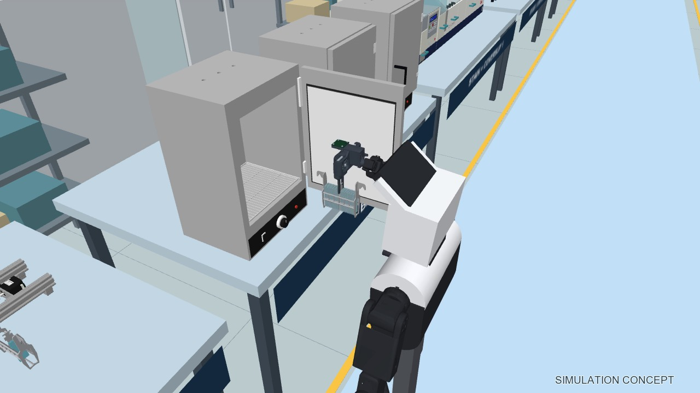](promo_v4/ExHist-Labs-Promo-60s.mp4)

[Watch/download the 60-second MP4](promo_v4/ExHist-Labs-Promo-60s.mp4) · [Demo instructions and evidence](docs/PROMO.md)

Nori opens the oven with its left claw, carries an upright rack with its straight parallel gripper, closes the oven, and loads the stainer. The stainer places the rack in the first rear vessel as Nori leaves. Background LeHisto sorting and the logo ending are included. The promo ovens have **120 mm extra upper clearance** as a modified concept, not stock Quincy dimensions.

The authored cut kept rack tilt below **0.018 degrees** and passed scoped geometric checks at all **1,800 frames**. This is **staged kinematic playback**, not a full-lab contact-physics result or proof of real slide retention. Fresh packaged checks and preserved author evidence are linked in the guide.

### Live laboratory scene

Windows 64-bit is the tested platform. Use **Python 3.10, MuJoCo 3.4.0 and PlaCo 0.9.20** for the live LeHisto loop. A desktop OpenGL-capable display/driver is needed for the viewer and screenshot rendering. Fusion is **not** required to run the simulation. No ROS, robot, camera or hardware connection is required.

Clone this repository (or download and extract its ZIP), then open a terminal in its root:

```powershell
conda env create -f environment.yml
conda activate exhist-sim
python tools/unpack_assets.py
python tools/check_install.py
python lab_rail_loop.py
```

The Conda environment gets the Windows PlaCo build from conda-forge. Other Python dependencies are pinned in [requirements.txt](requirements.txt). These versions were tested in an existing Windows environment; the environment file is a reproducible setup specification, not a claim of testing every fresh OS installation.

The viewer starts **paused**. Press **Space** to start/pause, **L** for LeHisto detail, **O** for the whole room, **1–8** for stations, and **+ / −** for playback speed. Close the window to exit. Initial loading can take a while because detailed CAD meshes are compiled.

PowerShell alternative, after activating the environment:

```powershell
./launch.ps1                       # live LeHisto loop
./launch.ps1 -Mode layout          # static/kinematic CAD inspection
./launch.ps1 -Mode hold            # readiness-hold view
```

If PowerShell blocks scripts, use the direct Python commands; changing system execution policy is unnecessary. The launcher uses the active environment's Python, not an author-specific installation path.

### Individual asset inspection

Each generated asset XML is a **static inspection model**, not a replacement for articulated machine physics. For example:

```powershell
python -m mujoco.viewer --mjcf models/assets/rack24.xml
```

### Nori equipment doors/drawers — separate environment

The original Nori access evidence used **MuJoCo 3.12.0 / Python 3.12**, not the live-loop engine. Keep these environments separate:

```powershell
conda create -n exhist-access -c conda-forge python=3.12 pip
conda activate exhist-access
python -m pip install -r requirements-access.txt
python tools/unpack_assets.py
python access_viewer.py --kind quincy
```

Kinds: `quincy`, `s60`, `st_load`, `st_unload`, `cv_load`, `ts_drawer`. These are **fixed-dock, actual-arm contact experiments**; the base is anchored and door/drawer dynamics are provisional. They are not complete mobile rack-transfer sequences. Keep the guards enabled.

### Headless checks

In `exhist-sim`:

```powershell
python tools/check_install.py
python -m unittest test_lab_rail_loop -v
python lab_rail_loop.py --validate
```

The last command reruns all eleven transfers and writes new `rail_loop_lab*.json` evidence. It may take several minutes or longer. It is not a whole-lab validation. Do not commit regenerated traces without inspecting the result. Existing files are versioned, so use a clean checkout or separate copy if preserving the packaged evidence matters.

### Troubleshooting

- **Missing file / compressed asset:** run `python tools/unpack_assets.py`. The script verifies SHA-256 and refuses to overwrite modified files. Large STEP/trace files are gzip-compressed to avoid normal GitHub file-size limits; Git LFS is not required.
- **Wrong MuJoCo version:** activate `exhist-sim` for the LeHisto loop, `exhist-access` for Nori access. Do not upgrade the physics engine and assume prior evidence still applies.
- **PlaCo import/DLL problem on Windows:** use the supplied Conda environment rather than assuming a Windows pip wheel exists. See [PlaCo installation documentation](https://placo.readthedocs.io/en/latest/basics/installation_pip.html).
- **OpenGL/display error:** use a local graphical desktop and working graphics driver. Headless rendering setup is platform-specific and is not bundled.
- **Pinned dependency/hash mismatch:** restore the matching repository revision or deliberately rebuild and revalidate. Do not disable integrity checks.
- **Neutral-pose adjacent-link warnings from PlaCo:** these are emitted by the imported IK model at initialization. The live loop has separate contact/failure guards; these messages are not a certification that all self-collisions are resolved.

## Station tour

These are actual renders of the packaged current model, not AI-generated concept images. The images show layout, not proof that every interaction works.

| Station | Purpose / equipment |
| --- | --- |
| Protocol sorting | Two LeHisto robots; protocol grouping and handled rack staging. |
| Baking | Three Quincy incubators. |
| Routine stain + coverslip 1 and 2 | Two Leica ST5020/CV5030 workstations with overhead canopies. |
| Special stain | One LeHisto, eleven matching containers, 25.4 mm inserts and canopy. |
| Send-out / block QC | Two LeHisto robots, slide folders and embedded cassette blocks. |
| Imaging 1 and 2 | Two Hamamatsu NanoZoomer S60 scanners with PCs. |
| Support / finished bench | Preparation, general work, documentation and digital-review bays. The general-work bench is the planned finished-folder destination. |

### Protocol sorting

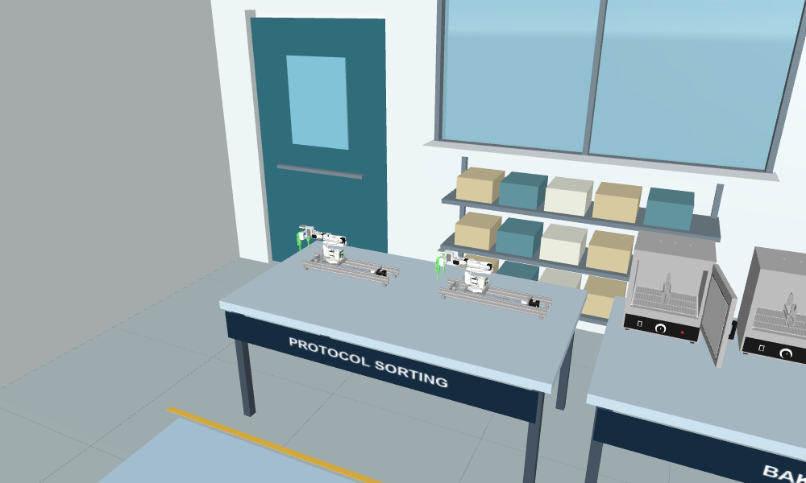

Two LeHisto stations and rack staging. Populated-rack sorting and Nori handoffs are still under development.

### Baking

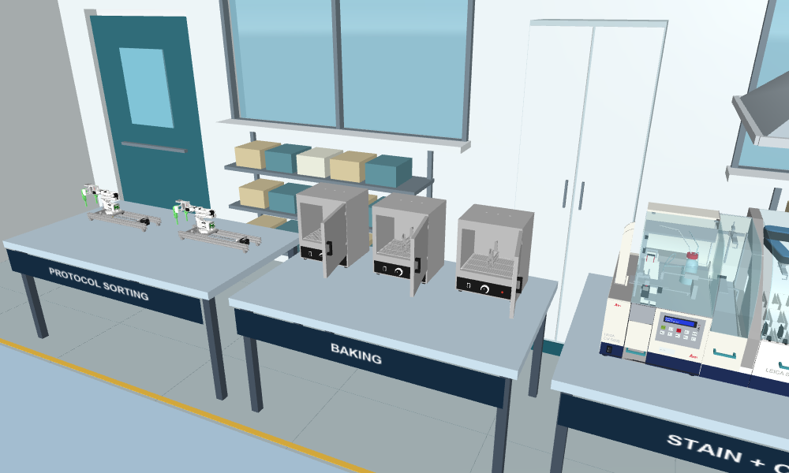

Three Quincy incubators. Doors are physical in isolated access tests; thermal processing is not modeled.

### Routine stain + coverslip 1

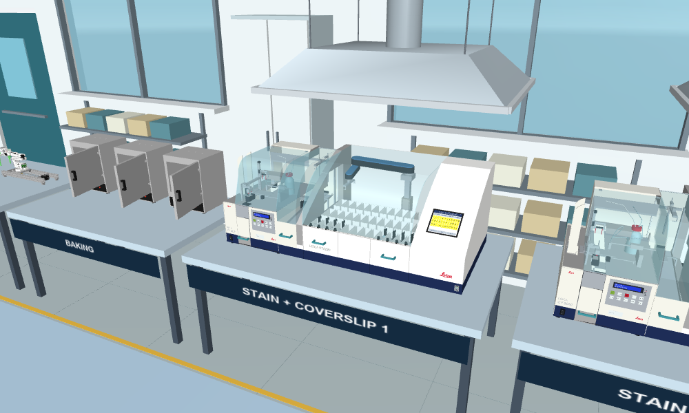

Leica ST5020/CV5030 workstation, access pulls and canopy. Inspection glazing lets the internals remain visible.

### Routine stain + coverslip 2

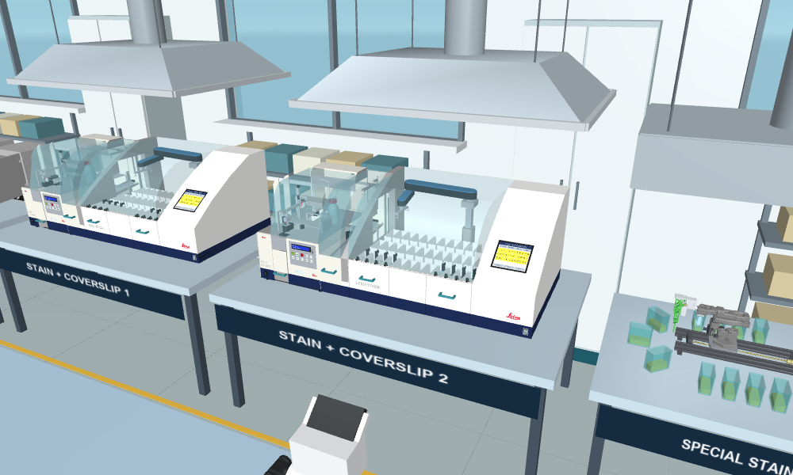

Second routine-processing bay. Internal articulation does not establish contact-validated payload transfer.

### Special staining

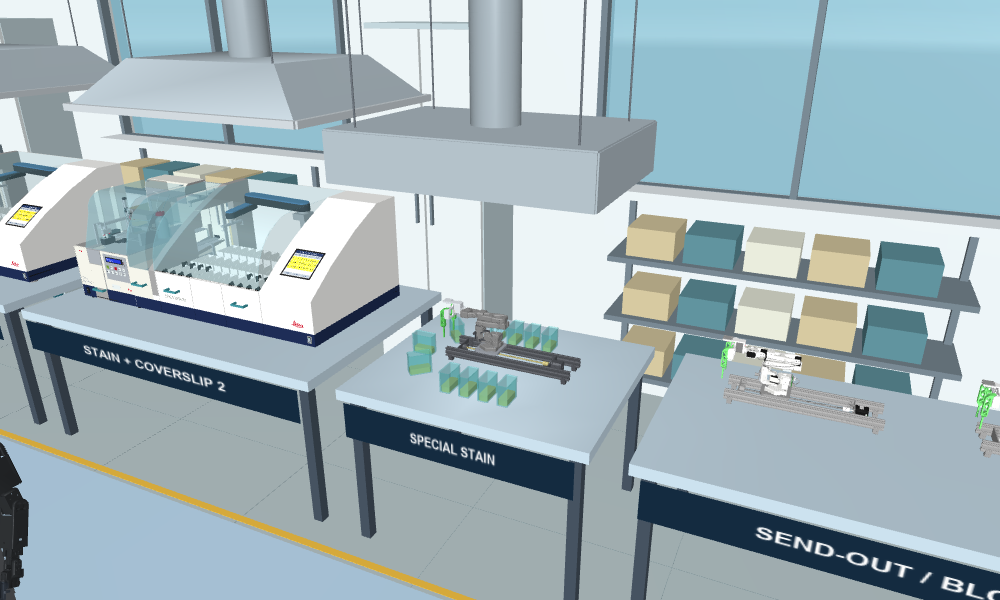

Live eleven-bath route: 1 → 2 → … → 11 → 1, original gripper, one-inch risers and bounded tabletop.

### Send-out / block QC

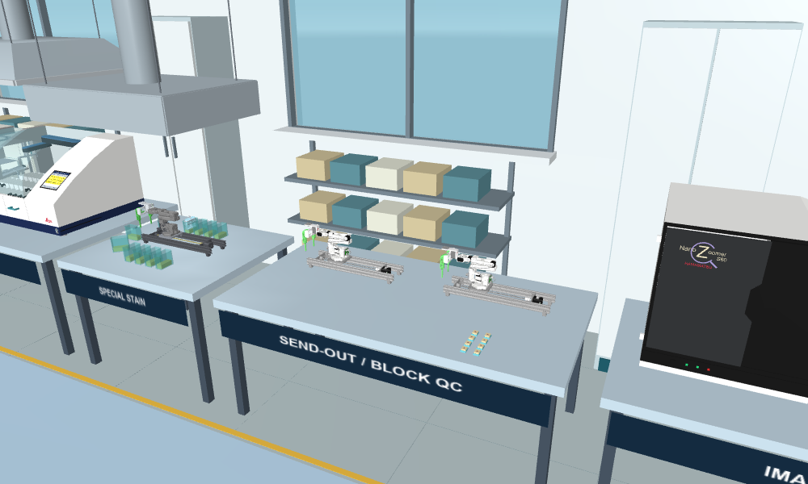

Two LeHisto arms, folder workspace and cassette-block QC. Folder loading/closing/carrying is not yet physically validated.

#### New: 45-degree QC folder cradle (selectable layout)

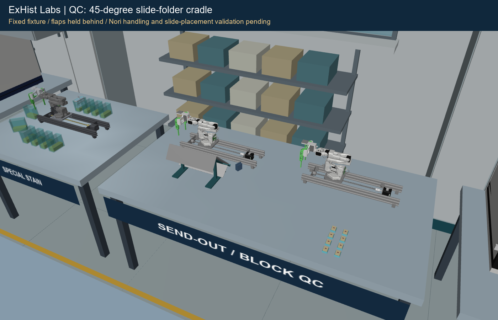

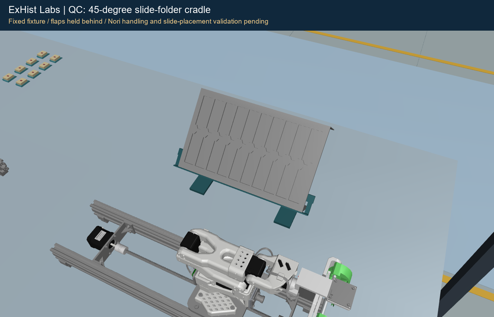

The pinned concept places a 20-pocket folder on a fixed, 45-degree presentation cradle in front of the left QC LeHisto. Its cover flaps are held behind the tray; the feet sit on the 800 mm bench. Empty side-access volumes are reserved for Nori's left arm, but are **not certified gripper envelopes**. No second Nori has been added. Nori need not continuously hold the folder in this fixture concept.

```powershell
python qc_folder_cradle.py                    # held whole-lab QC inspection
python lab_rail_loop.py --qc45                # live special-stain loop + held QC layout
python qc_folder_cradle.py --check            # scoped static layout checks
python -m unittest test_qc_folder_cradle -v
```

Press **6** in the live-loop viewer for QC. This optional composition preserves the existing tested base XML and historical evidence. The new 45-degree slide-placement controller is still being tested separately and is **not imported or claimed passed**. Passive folder docking, Nori reach/grasp/transfer, fasteners, stiffness, stability, flap closing and loaded retention remain unvalidated.

[Layout and assumptions](docs/QC_FOLDER45.md) · [stand STL, mm](cad/stl/Folder-Stand-45-Assembly.stl) · [standalone folder/cradle XML, m](models/assets/qc_folder45.xml) · [scoped check results](qc_folder45_validation.json)

### Imaging 1

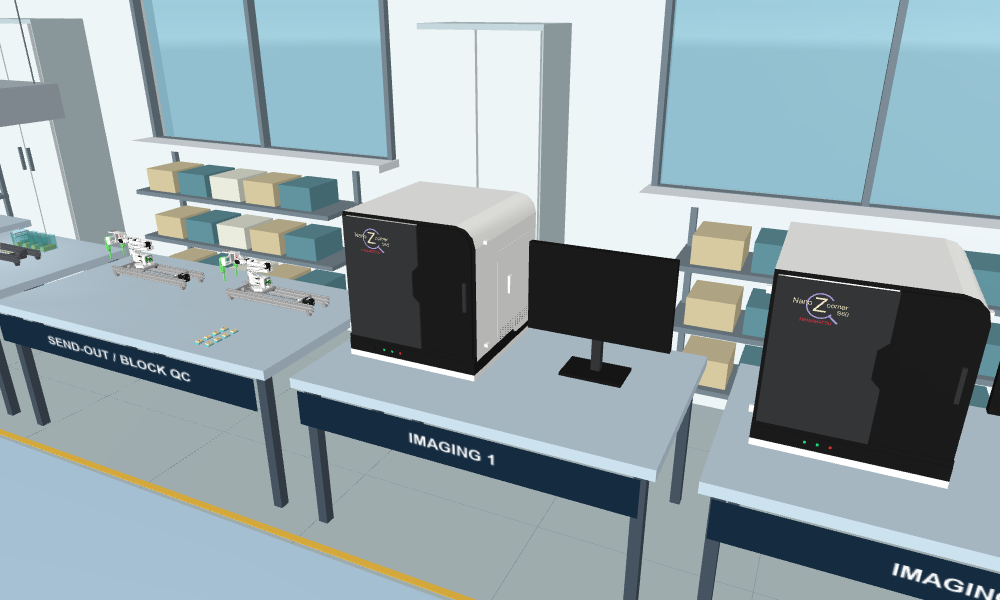

NanoZoomer S60 and PC; scanner cassette interfaces and Nori insertion need further integration.

### Imaging 2

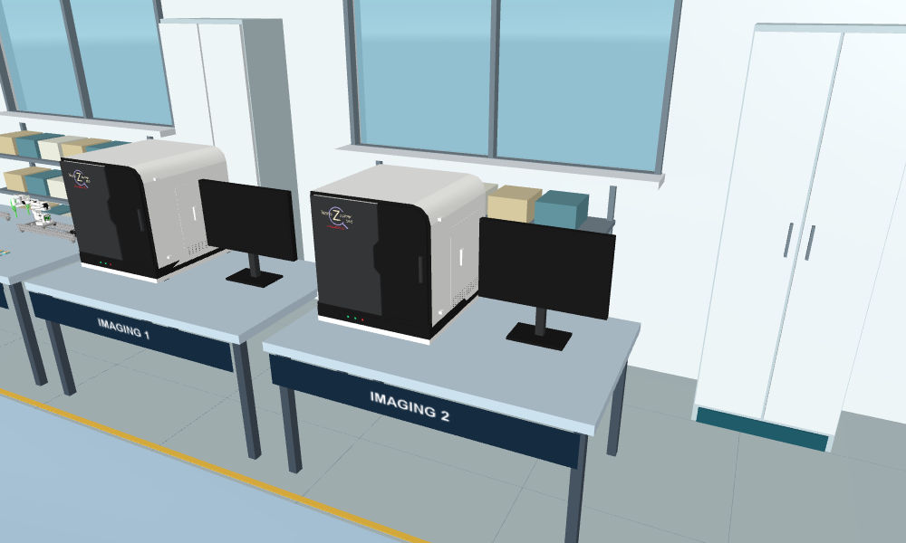

Second scanner and PC with the same development limitations.

### Nori A3 and the surrounding lab

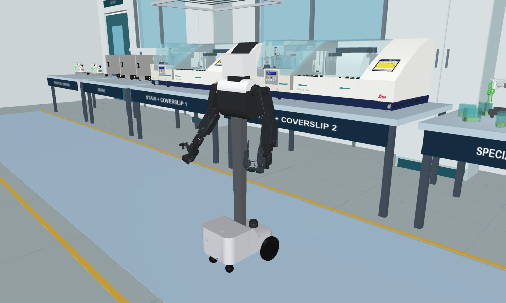

Nori retains the stock left claw and the parallel histology gripper on the other arm. Its raised inspection posture keeps the shoulders above the 800 mm benches. Gripper grooves are user-tested hardware geometry; the complete simulated grasp/transfer chain still needs validation. Nori’s source model is [bundled here](source/nori/Nori%20with%20parallel%20histo%20gripper.xml), with [mesh files](assets/nori) and [license/limitations](licenses/nori/NOTICE). **No Nori STEP manufacturing CAD was supplied; none is fabricated from these meshes.**

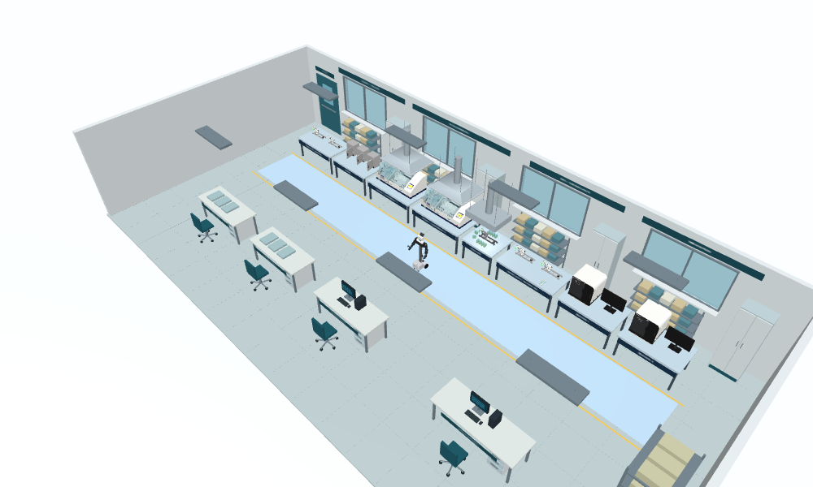

The architectural context includes four windows, two doors, four tall cabinets, five shelving bays, four extra work tables, four chairs and two additional PCs. The eight process benches, hoods, aisle markings, furniture and signage are procedural geometry in [lab_room.py](lab_room.py), [build_scene.py](build_scene.py), and the main XMLs. They are static scene props; door swing, furniture mechanics and fume extraction are not validated. Canopies are layout concepts, not ventilation designs.

## Asset gallery and downloads

**STL exports below use millimetres; MuJoCo XML/OBJ geometry uses metres.** Original robot STLs keep their original scales, specified in their XML/URDF; do not apply the catalogue STL scale indiscriminately. Native CAD assemblies and simulation tessellations are different deliverables. See [CAD provenance and conventions](docs/CAD_AND_ASSETS.md).

### LeHisto v38

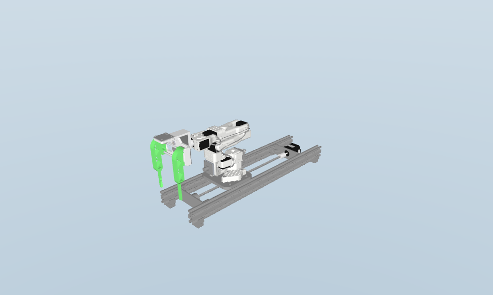

Rail-mounted SO-101 arm with the printed dual-groove slide/handle gripper and cameras.

[STL](cad/stl/lehisto.stl) · [Asset XML](models/assets/lehisto.xml) · [Source tessellation](assets/lehisto.json) · [STEP/STP](cad/step/lehisto-v38.stp)

### Quincy 10GC incubator

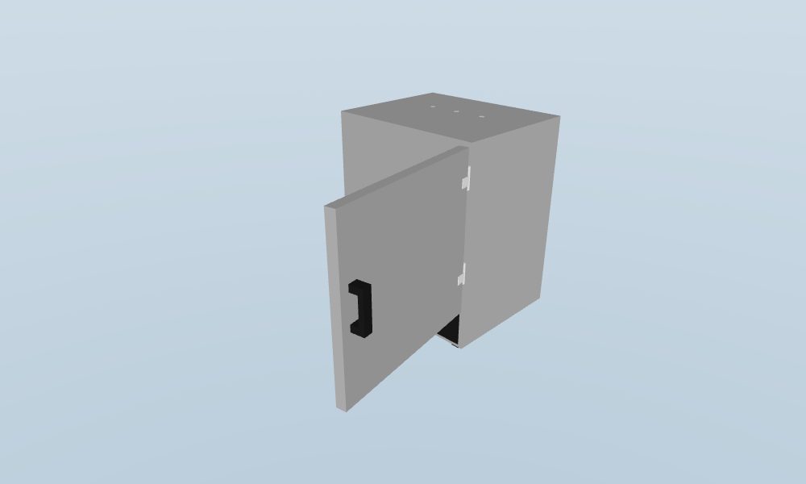

Baking enclosure and swing door. Three instances sit on the baking bench.

[STL](cad/stl/quincy.stl) · [Asset XML](models/assets/quincy.xml) · [Source tessellation](assets/quincy.json) · [STEP/STP](cad/step/quincy-10gc.stp)

### Leica ST5020 + CV5030

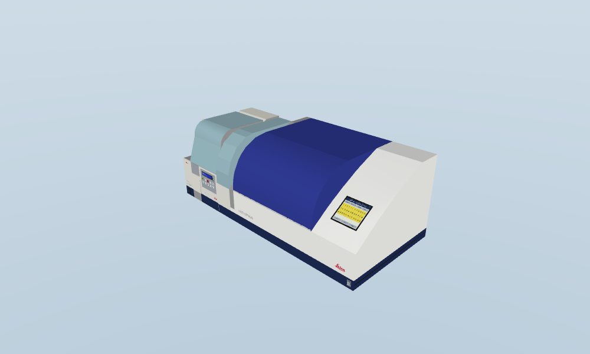

Stainer, coverslipper and transfer station. CAD articulation and estimated internals are retained; transparent lids are a simulation inspection setting.

[STL](cad/stl/leica_workstation_handled.stl) · [Asset XML](models/assets/leica_workstation_handled.xml) · [Source tessellation](assets/leica_workstation_handled.json) · [STEP/STP (gzip)](cad/step/leica-workstation.stp.gz)

### Hamamatsu NanoZoomer S60

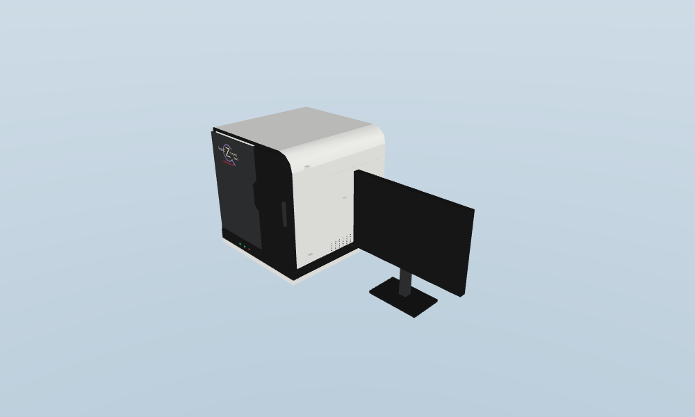

Branded scanner assembly and PC. Scanner depth and carrier interfaces remain provisional.

[STL](cad/stl/s60.stl) · [Asset XML](models/assets/s60.xml) · [Source tessellation](assets/s60.json) · [STEP/STP](cad/step/nanozoomer-s60.step)

### 24-slide handled rack

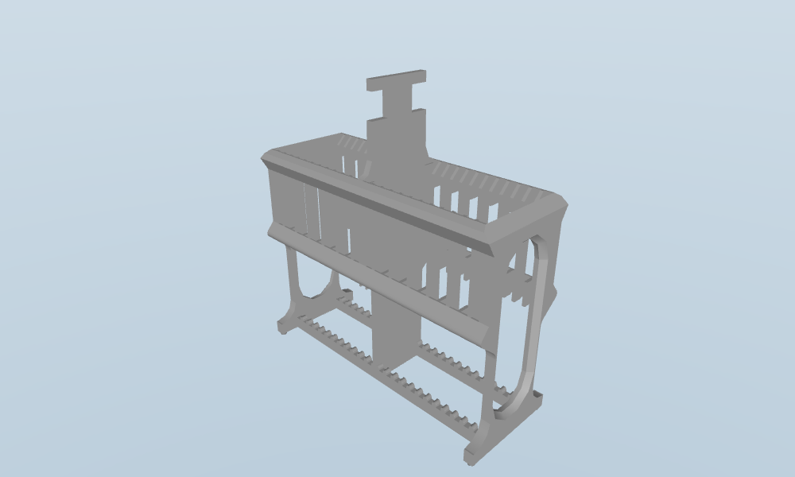

User-tested handle geometry; not interchangeable with the Leica or scanner carriers.

[STL](cad/stl/rack24.stl) · [Asset XML](models/assets/rack24.xml) · [Source tessellation](assets/rack24.json) · [STEP/STP](cad/step/slide-rack-24-with-container.stp)

### Matching 24-slide container

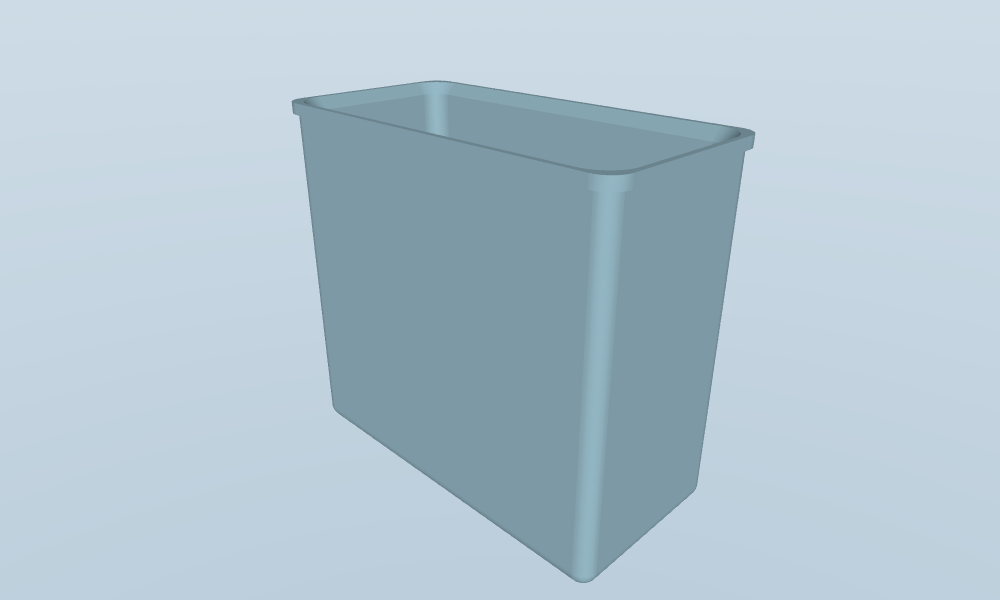

Actual companion vessel for the rack; eleven are arranged around the special-staining rail.

[STL](cad/stl/rack24_jar.stl) · [Asset XML](models/assets/rack24_jar.xml) · [Source tessellation](assets/rack24_jar.json) · [STEP/STP](cad/step/slide-rack-24-with-container.stp)

### 25.4 mm container insert

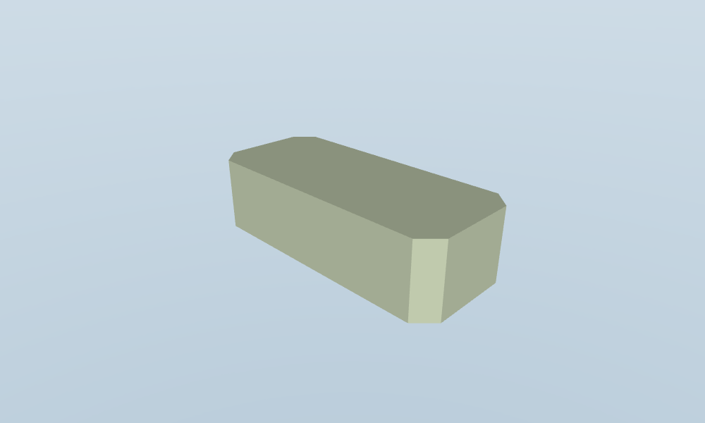

Removable one-inch support block. Material, fluid compatibility and immersion depth are unvalidated.

[STL](cad/stl/rack24_riser.stl) · [Asset XML](models/assets/rack24_riser.xml) · [Source tessellation](assets/rack24_riser.json) · [Parametric source](assets/rack24_riser_25p4mm.scad)

### Handled Leica staining rack

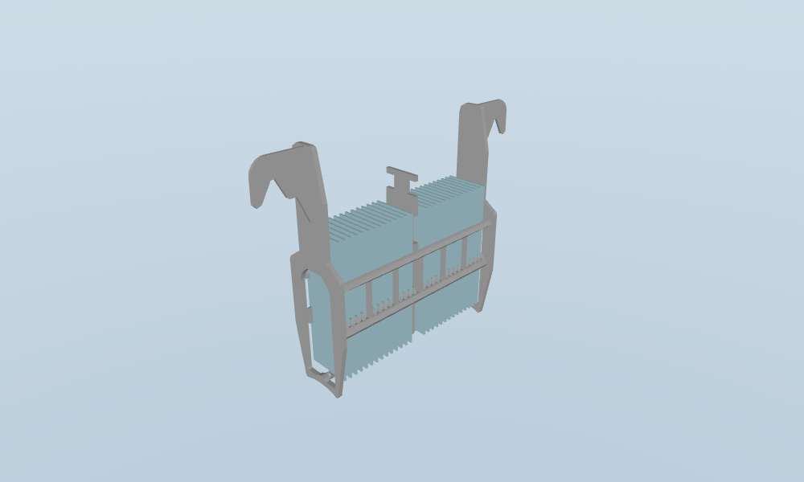

Updated input rack with carrying handles. Native export captures the open Fusion document, including its unsaved local state.

[STL](cad/stl/leica_rack_handled.stl) · [Asset XML](models/assets/leica_rack_handled.xml) · [Source tessellation](assets/leica_rack_handled.json) · [STEP/STP](cad/step/leica-rack-handled.stp)

### CV5030 30-position output magazine

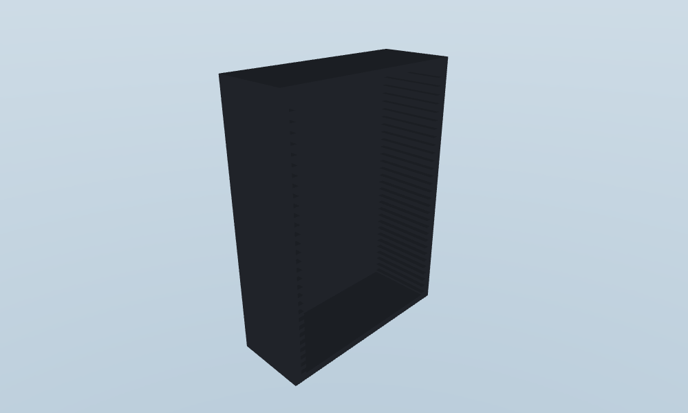

Output carrier for coverslipped slides. Automated removal and populated slide exchange are unfinished.

[STL](cad/stl/output_magazine.stl) · [Asset XML](models/assets/output_magazine.xml) · [Source tessellation](assets/output_magazine.json) · [STEP/STP](cad/step/cv5030-output-magazine-30.step)

### Scanner cassette

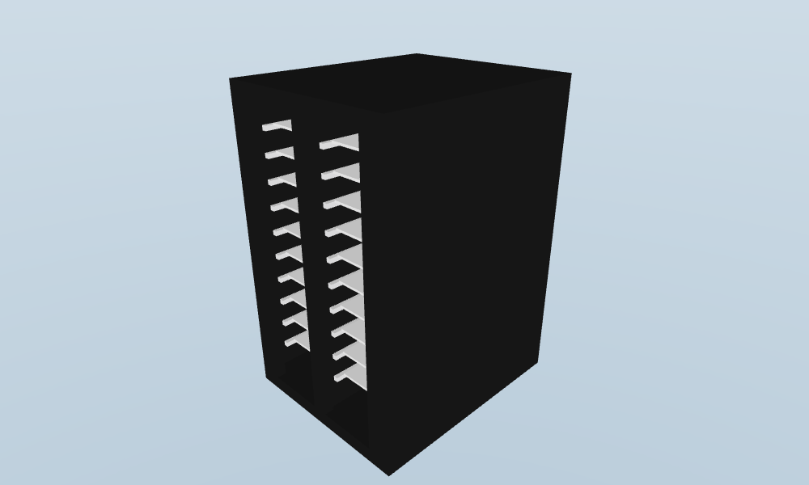

S60-specific carrier. Its depth is explicitly provisional; this export does not establish slide/gripper clearance.

[STL](cad/stl/scanner_cassette.stl) · [Asset XML](models/assets/scanner_cassette.xml) · [Source tessellation](assets/scanner_cassette.json) · [STEP/STP](cad/step/scanner-cassette-provisional.stp)

### 20-place slide folder

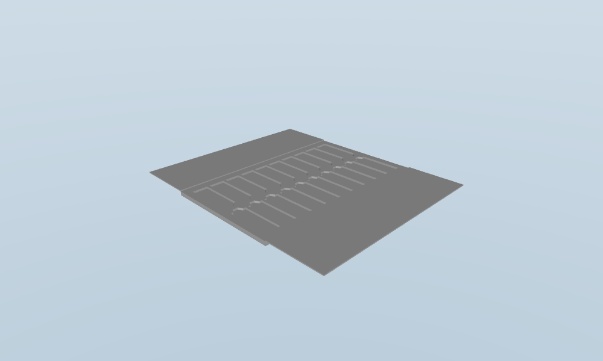

Cardboard folder and cover flaps. Physical folding, loaded retention and left-hand transport remain unfinished.

[STL](cad/stl/slide_folder.stl) · [Asset XML](models/assets/slide_folder.xml) · [Source tessellation](assets/slide_folder.json) · [STEP/STP](cad/step/slide-folder-20.stp)

### Embedded cassette block

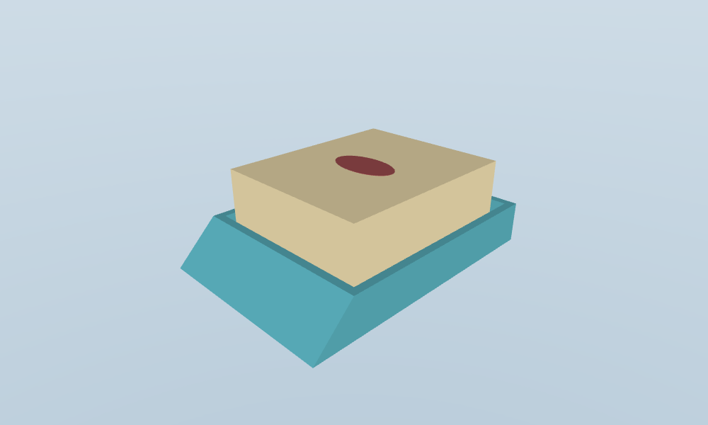

Cassette, paraffin and tissue geometry for the block-QC work surface.

[STL](cad/stl/cassette_block.stl) · [Asset XML](models/assets/cassette_block.xml) · [Source tessellation](assets/cassette_block.json) · [STEP/STP](cad/step/embedded-cassette-block.step)

### Grippers, handles, slides and coverslips

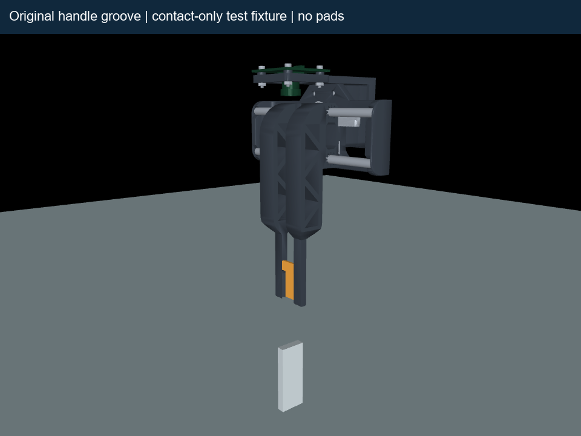

The top finger groove receives rack handles; the lower groove receives slides. The detailed LeHisto gripper/rail source meshes and joint descriptions are in [rail_loop_reference/source/robot](rail_loop_reference/source/robot). Nori's attachment meshes are in [assets/nori](assets/nori). [Drawer pulls v02](cad/step/drawer-pulls-v02.step) and the [Quincy stand-off pull](cad/step/quincy-pull-v01.step) are **unbuilt concepts**, not approved machine modifications. Slides, coverslips, support surfaces and fixture/contact proxies also appear as procedural geoms in the XMLs. The loaded rack in the current eleven-bath loop uses fixed slide visuals, **not individually free glass**.

### Procedural room asset kit

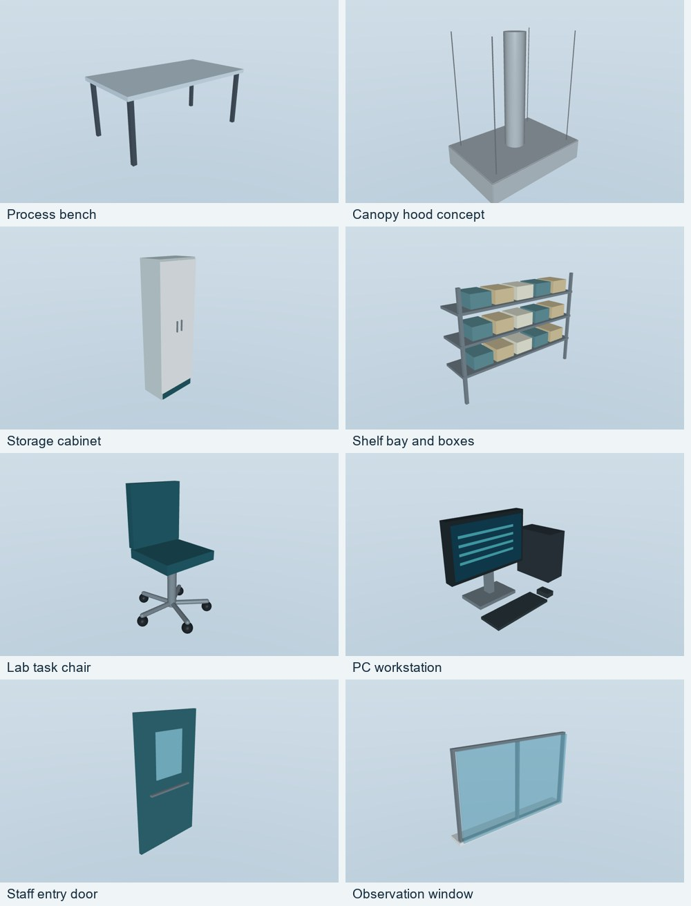

These representative pieces are exported from the actual scene geometry. They are static visual models, not fabrication designs or mechanically validated furniture.

| Asset | STL | XML |
| --- | --- | --- |
| Process bench | [STL](cad/stl/bench.stl) | [XML](models/assets/bench.xml) |
| Special-stain canopy | [STL](cad/stl/canopy.stl) | [XML](models/assets/canopy.xml) |
| Storage cabinet | [STL](cad/stl/cabinet.stl) | [XML](models/assets/cabinet.xml) |
| Shelf bay and boxes | [STL](cad/stl/shelves.stl) | [XML](models/assets/shelves.xml) |
| Task chair | [STL](cad/stl/chair.stl) | [XML](models/assets/chair.xml) |
| PC workstation | [STL](cad/stl/pc.stl) | [XML](models/assets/pc.xml) |
| Entry door | [STL](cad/stl/entry-door.stl) | [XML](models/assets/entry-door.xml) |
| Observation window | [STL](cad/stl/window.stl) | [XML](models/assets/window.xml) |

## Files and data

| Location | Contents |
| --- | --- |
| `exhist_rail_loop.xml` | Current complete-room model with live special-stain station and held lab context. |
| `exhist_operational.xml` | Articulated development scene / readiness workbench. |
| `exhist.xml` | Static/kinematic lab inspection layout. |
| `assets/` | Actual mesh, texture, tessellation and kinematic assets used by the lab. |
| `models/assets/` | Individual static asset XML viewers and their meshes. |
| `cad/step/` | Native STEP/STP exports; large workstation file is losslessly compressed. |
| `cad/stl/` | Consolidated millimetre STL exports of the catalogued CAD assets. |
| `source/` | Bundled source Nori XML and mesh dependencies. |
| `rail_loop_reference/` | Pinned reference controller, URDF, scene, meshes and evidence. |
| `docs/images/` | Rendered station/asset gallery. |
| `docs/portability-validation.json` | XML-parameter and compiled-dynamics comparison after path relocation. |
| `docs/DEVELOPMENT_HISTORY.md` | Historical author notes; older claims/launch paths do not override this README. |

Authoring/export scripts remain for provenance and development. Some historical Fusion/film/rebuild helpers refer to the author's external projects and are **not portable entry points**. Running the delivered XMLs and documented viewers does not require those external projects. Do not blindly regenerate source snapshots from other tasks.

## Validation and limitations

The packaged copy passed a fresh **11/11 transfer run** and **20 targeted regression tests**. See [distribution validation](docs/DISTRIBUTION_VALIDATION.md) for versions, measurements and scope.

The original lab loop completed all eleven contact-driven rack transfers. A fresh packaged-copy run and its scope are recorded in [rail_loop_lab_validation.json](rail_loop_lab_validation.json). [LAB_RAIL_LOOP_RESULTS.md](LAB_RAIL_LOOP_RESULTS.md) describes the original integration evidence, including its export-recovery provenance. [STABILITY_VALIDATION.md](STABILITY_VALIDATION.md) describes separate fixed-dock access/passive-object tests. Those are distinct experiments, not an end-to-end lab acceptance test.

The portability check compares all non-path XML parameters and 420 numerical model arrays per model. Resource-path buffers and MuJoCo-derived convex-hull representation differences are reported separately. No controllers, joint limits, physical forces or contact rules were relaxed to package the demo.

**Still unfinished:** coordinated Nori navigation/docking and handoffs; populated carrier exchange; CV5030 output-rack extraction; scanner insertion/removal; complete physical folder loading, closing and transfer; room-wide collision coverage. Fluids, chemistry, glass breakage, optical scanning, medical performance and hardware safety are not validated.

This repository is a development workbench, **not** a turnkey autonomous lab, learned policy, manufacturer-certified digital twin, medical device, or authorization to operate equipment.

[Licensing / attribution / noncommercial Nori restrictions](LICENSE-NOTICE.md)
