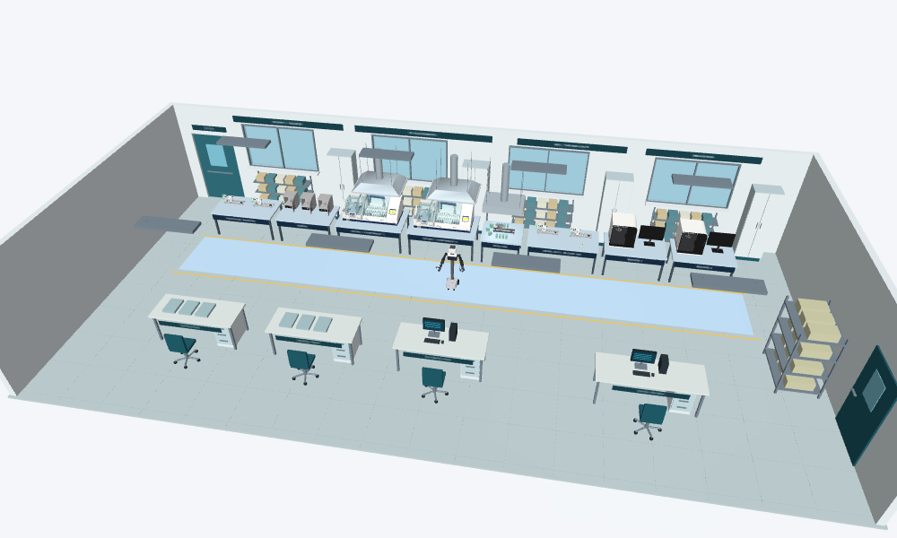

# ExHist Labs Simulation

A CAD-based histology laboratory in MuJoCo, with LeHisto stations, Nori A3, incubators, staining/coverslipping, scanning, and slide send-out/QC.



**Research simulation / development snapshot.** The live demo validates a bounded LeHisto rack loop. The promo is staged kinematic playback, not a physically validated autonomous lab.

## Browse by purpose

| Looking for | Open |
| --- | --- |
| Install, run, and tour every station | [Full illustrated guide](simulation/README.md) |
| Latest 60-second video | [Watch/download promo](simulation/promo_v4/ExHist-Labs-Promo-60s.mp4) |
| Promo instructions and limitations | [Promo guide](simulation/docs/PROMO.md) |
| CAD STEP/STP and STL files | [CAD folder](simulation/cad/) |
| Static asset XMLs | [Asset models](simulation/models/assets/) |
| Station and asset pictures | [Image gallery](simulation/docs/images/) |
| Original/pinned source assets | [Source folder](simulation/source/) |
| Simulator mesh and texture assets | [Runtime assets](simulation/assets/) |
| Validation and distribution notes | [Validation record](simulation/docs/DISTRIBUTION_VALIDATION.md) |
| Repository organization | [Folder map](docs/REPOSITORY_LAYOUT.md) |
| Licensing and attribution | [License notice](simulation/LICENSE-NOTICE.md) |

## Run

From the repository root, using the documented Windows/Conda setup:

```powershell
cd simulation
conda env create -f environment.yml
conda activate exhist-sim
python tools/unpack_assets.py
python tools/check_install.py
python lab_rail_loop.py
```

After setup, `./launch.ps1` from the repository root starts the live demo. The viewer starts paused; press Space to run. See the full guide for controls and the separate Nori equipment-access environment.

The historical simulation bundle is kept together under `simulation/` so its CAD/XML references, Python imports, and evidence hashes retain their meaning. This organization-only update does not change robot motions, grippers, camera cuts, or the promo logo; those requested changes remain separate work.
