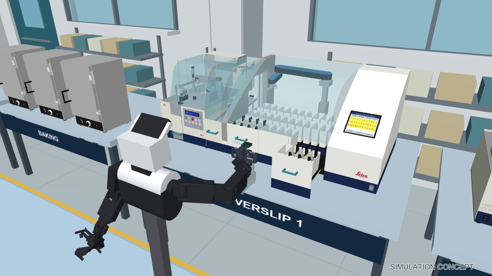

# Upright-rack 60-second promo

[Play/download the video](../promo_v4/ExHist-Labs-Promo-60s.mp4)




The right parallel gripper is straight. Loaded trajectories retain an upright rack and reject large joint-configuration jumps. Left-claw oven closure, drawer access, restricted jaw release, stainer-fork pickup and rear-vessel placement are included. The concept ovens have 120 mm additional upper clearance, with unchanged shelf/pull heights. This is not native manufacturer CAD or an approved machine modification.

## Re-render the bundled motion

Modified oven geometry: [STL, millimetres](../cad/stl/quincy-promo-tall-concept.stl) and [static XML viewer, metres](../models/assets/quincy-promo-tall.xml). The original Quincy STEP in the main asset gallery remains the original-height model; no native STEP of this stretched concept is claimed.

After installing the root README's Windows exhist-sim environment (Python 3.10, MuJoCo 3.4.0):

```powershell
conda activate exhist-sim
python tools/unpack_assets.py
python promo_demo.py --render --sixty
python promo_video_verify.py
```

Output: promo_v4/ExHist-Labs-Promo-60s.mp4, 1280 x 720, 30 fps, exactly 60 seconds. Rendering needs desktop OpenGL. It replays bundled states and the exact background trace; no robot or camera connection is used. The pre-rendered video needs no Python environment.

The scene uses repository-relative resources. Motion, logo, manifests and a losslessly compressed background trace are included. Do not use the experimental --plan authoring option merely to watch the demo: it replaces motion and requires separate revalidation.

## Repeat scoped geometric checks

Use the separate Python 3.12 / MuJoCo 3.12.0 environment:

```powershell
conda activate exhist-access
python -m pip install -r requirements-promo-checks.txt
python tools/unpack_assets.py
python promo_solid_audit.py 1
python promo_postflight.py
```

The first check uses manifold3d for CAD-solid intersections across all 1,800 frames. The second checks orientation, grasp alignment, joint continuity/limits, container clearance, oven closure and rear-vessel seating. Rerunning replaces reports; keep a clean copy if preserving evidence matters.

Reports: [CAD audit](../promo_v4/promo_solid_audit_step1.json), [postflight](../promo_v4/promo_postflight.json), [decoded video](../promo_v4/promo_video_verification.json), [resource portability](promo-portability.json). Original reports remain in promo_v4/author-evidence and are not relabeled as fresh packaged tests.

## Limits

This is staged kinematic playback, not autonomous full-lab execution. Checks cover the oven/stainer interaction corridor, cross-arm geometry, rack/head/left-arm clearance and stainer motion against fixed equipment. Intended claw/handle and fork/rack contacts are excluded. Non-manifold robot meshes use conservative convex hulls; the reported solid-intersection threshold is 0.02 cubic millimetres. Frame sampling is not continuous-time certification.

Slides are fixed rack visuals here. Upright orientation does not validate retention under acceleration, vibration, slip or gripping forces. Full carrier exchange, coverslipper-to-scanner slide transfer, scanning, loaded folder handling and room-wide dynamics remain unfinished. The separately contact-tested LeHisto loop is described in the main README.
