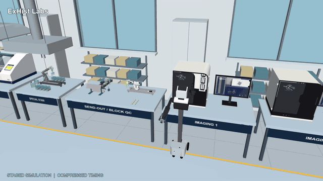

# ExHist Labs promo — revision 5

[](ExHist-Labs-Promo-60s.mp4)

[Watch/download the full-quality MP4](ExHist-Labs-Promo-60s.mp4) — 60 seconds,
1280 × 720, 30 fps. The GIF loops indefinitely; GitHub may pause animated images
when a viewer has reduced-motion or autoplay-disabled settings.

## What's in this revision

- Left parallel slide/rack gripper; original right claw for doors and drawers.
- Loaded scanner with 60 individual slide meshes and the supplied PC screenshot.
- Recorded LeHisto folder placement, slide sorting and special-stain background work.
- Upright oven-to-stainer rack transfer; oven and drawer close afterward.
- Fading top-right close-ups of rack pickup and stainer placement/release.
- Stainer fork deposits into the first rear vessel; Nori keeps rolling away
  through the fade into the supplied teal/black logo.

## Replay locally

Use the repository's documented Windows `exhist-sim` environment (MuJoCo 3.4.0),
then from `simulation/`:

```powershell
python promo_v5/render.py --check
python promo_v5/render.py
```

The second command writes `promo_v5/rerendered.mp4`; it does not overwrite the
published video. Desktop OpenGL is required. All scene resources are repository
relative; no author workspace, camera connection or hardware is needed.
`playback.npz` contains the exact 1,800 output-time joint/mocap/background poses
and both cameras, not a controller or training policy. Existing STEP/STL source
assets remain under `../cad/`, `../assets/` and `../source/`.

## Evidence and limits

- [Original sampled geometry audit](evidence/author-sequence-solid-audit.json):
  zero unintended intersections in its scoped 1,800-frame checks; maximum
  loaded rack tilt 0.008287 degrees.
- [Tool-swap audit](evidence/author-swap-mechanics-audit.json): original joint
  limits, mount frames, printed grooves and jaw coupling preserved.
- [Packaging equivalence](evidence/portability.json): resource paths changed,
  but compiled geometry, joint and inertia arrays match the author model.
- [Packaged replay check](evidence/packaged-render-check.json): rendered-frame
  comparisons, MP4 duration, GIF duration and indefinite-loop metadata.
- [Author delivery verification](evidence/author-delivery-gripper-closeups-rollaway-verification.json).

**Staged kinematics / compressed timing, not physically validated autonomy.**
Objects use prescribed poses/attachments. These checks do not certify grasp
forces, slip, actuator torque/speed, wheel-contact dynamics, passive-door forces,
whole-room continuous collision avoidance, hardware safety or actual throughput.
The oven is a user-authorized taller simulation concept (+120 mm upper headroom),
not manufacturer-certified dimensions or an updated manufacturing STEP.
Background folder work replays one previously tested pocket placement, not a
complete 20-slide folder. Original author reports are preserved as provenance;
they are not relabeled as newly executed packaged physical tests.

The prior v4 bundle remains available at `../promo_v4/` for history.
